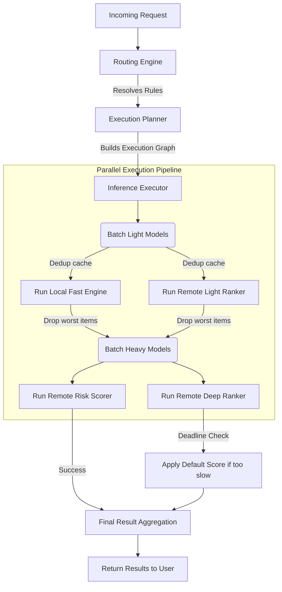

# ML Inference Routing SDK


## 📖 What is this library?
At its core, this is a **traffic controller for Machine Learning models** in Java. If your backend application needs to ask an AI/ML model for predictions, scores, or rankings, this SDK ensures that those requests happen incredibly fast and never crash your application.

## 🛑 The Problem: "Latency Explosion"
Imagine you are building an e-commerce app. A user searches for "sneakers". Your database finds **1,000** matching sneakers. Now, you want to use a Machine Learning (ML) model to score and rank them so the best sneakers show up at the top of the page.

* **The Naive Approach:** You loop through the 1,000 sneakers and send 1,000 separate network requests to your remote ML model.
* **The Result:** The network gets clogged, the remote model gets overwhelmed, and the search takes 5 seconds to load. The user gets frustrated and leaves.

## 💡 The Solution
This SDK solves this problem by treating ML inference like a smart pipeline:
1. **Lazy Pruning (Filtering early):** Instead of sending 1,000 items to a heavy remote model, the SDK first runs a super-fast, lightweight model *locally* on your server. It drops the bottom 900 items, and only sends the top 100 to the heavy remote model.
2. **Batching (Grouping):** Instead of sending 100 individual requests, the SDK groups them into 2 batches of 50, drastically cutting down network traffic.
3. **Deduplication:** If two items have the exact same features, the SDK only calculates the score once and reuses the answer.
4. **Strict Deadlines & Fallbacks:** If the remote model takes longer than 50 milliseconds to answer, the SDK cuts it off. Instead of crashing or waiting forever, it returns a safe "default score" so the user still gets their search results instantly.

---

## 🛠️ Step-by-Step: How to Use This Library

Using this SDK requires three simple steps: define your models, set up your rules, and run the executor.

### Step 1: Define your Models (`model-registry.yaml`)
You tell the SDK what models exist, how long they are allowed to take (`timeoutMs`), and what to do if they fail (`fallbackStrategy`).

```yaml
models:
  - modelId: my_heavy_ranker
    backendType: REMOTE
    timeoutMs: 50         # If it takes > 50ms, cut it off!
    maxBatchSize: 32      # Send 32 items at a time
    fallbackStrategy:
      type: CONSTANT_SCORE
      value: 0.5          # If it fails, just give everything a score of 0.5
```

### Step 2: Define your Routing Rules (`routing-rules.yaml`)
You tell the SDK *when* to use these models. For example, if a request is a "SEARCH", use the ranker.

```yaml
rules:
  - ruleId: run_search_models
    priority: 100
    enabled: true
    condition:
      requestType: SEARCH
    selectedModels:
      - my_heavy_ranker
```

### Step 3: Run the Java Code
Here is how you trigger the process in your application:

```java
// 1. Load your configurations
ModelRegistry registry = new ModelRegistry();
ConfigurationLoader.loadModels(new FileInputStream("model-registry.yaml")).forEach(registry::register);
RoutingEngine routingEngine = new RoutingEngine(ConfigurationLoader.loadRules(new FileInputStream("routing-rules.yaml")));

// 2. Setup your Executor (The traffic controller)
InferenceExecutor executor = new InferenceExecutor(myModelClient, threadPool, scheduler, metrics);

// 3. Create a Request (e.g., User searches for something)
RequestContext context = new RequestContext(
    "req-123", "SEARCH", Instant.now(), Instant.now().plusMillis(200), // Global 200ms deadline!
    Map.of(), myListOfCandidates, Map.of()
);

// 4. Execute! The SDK automatically batches, dedups, and enforces timeouts.
Set<String> selectedModels = routingEngine.route(context);
InferencePlan plan = new ExecutionPlanner(registry).plan(selectedModels);

InferenceResult result = executor.execute(plan, context).get();

System.out.println("Final Scores: " + result.outputsByModel());
```

---

## 🏗️ System Architecture (Under the Hood)

When you ask the SDK to execute models, it builds a **Directed Acyclic Graph (DAG)**. This means it figures out what models depend on other models and runs independent ones in parallel.



---

## 📦 What's Inside this Repository?

This is a Maven multi-module project:
- `ml-routing-core`: The main library. Contains the logic for routing, batching, DAG planning, and fallbacks. No heavy frameworks (No Spring) so it boots instantly.
- `ml-routing-vector-inference`: An optional add-on. It uses Java 21's new Vector API (SIMD) to run models directly on your CPU locally at lightning speed, avoiding network calls entirely.
- `ml-routing-examples`: Fully runnable Java classes showing exactly how to use the code.
- `ml-routing-benchmarks`: Speed tests comparing the naive approach vs. this SDK.

## 🚀 Quick Start (Running the Code)

You need **Java 21** and **Maven** installed on your machine.

```bash
# 1. Download and build the project
git clone https://github.com/shivam61/ml-inference-routing-sdk.git
cd ml-inference-routing-sdk
mvn clean install

# 2. Run the main Search Ranking Example
# (This demonstrates local models, remote models, and fallbacks working together)
mvn -pl ml-routing-examples exec:java -Dexec.mainClass="com.github.placeholder.mlinference.examples.SearchRankingExample"

# 3. Run the Deduplication Example
# (This proves that duplicate items are only computed once)
mvn -pl ml-routing-examples exec:java -Dexec.mainClass="com.github.placeholder.mlinference.examples.DedupExample"
```

## 📚 Deep Dive Documentation

If you want to understand the advanced engineering behind this, check out our docs:
- [Architecture Design](docs/architecture.md)
- [Execution Model (How Batching/Pruning works)](docs/execution-model.md)
- [Local Vectorized Inference (SIMD)](docs/local-vectorized-inference.md)
- [Configuration Reference](docs/config-reference.md)
- [Observability (Metrics & Tracing)](docs/observability.md)
