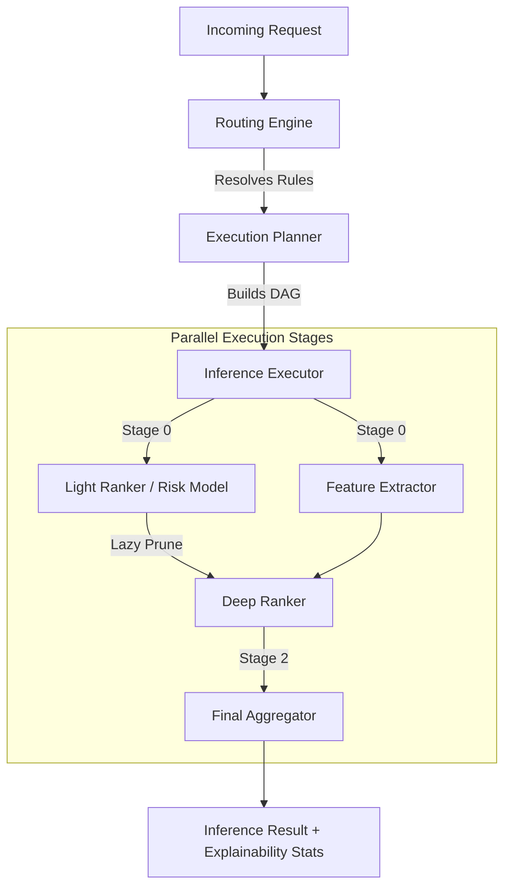

# 🚀 ML Inference Routing SDK

[](https://jdk.java.net/21/)
[](https://github.com/shivam61/ml-inference-routing-sdk/actions/workflows/ci.yml)
[](LICENSE)
[](#)

**High-Performance ML Inference Orchestration.** This SDK addresses the "Heavy Fan-out" problem in low-latency backend services. It treats online inference as a **Directed Acyclic Graph (DAG)** execution problem, applying database-style query optimizations like lazy pruning, batching, and request deduplication.

---

## 🏗️ System Architecture



---

## 💎 Why Use This SDK? (Engineering Impact)

| Feature | Engineering Logic | Performance Impact |
| :--- | :--- | :--- |
| **Concurrency** | Uses **Project Loom Virtual Threads** | Handles 10k+ concurrent model calls with negligible RAM overhead. |
| **Batching** | Groups candidate entities into optimal chunks | Reduces remote gRPC/REST round-trips by **10x-50x**. |
| **Deduplication** | **Canonical Hashing** (Murmur3 style) | Eliminates redundant computation for repeat items in <1μs. |
| **Resiliency** | **Circuit Breakers** & Deadline Propagation | Instant load shedding. Prevents a slow model from taking down the JVM. |
| **Fast Path** | **Local SIMD (Vector API)** Inference | Executing dense layers locally in **<50μs**, bypassing network hops. |

---

## 📊 Performance Benchmarks (Simulated)

*Note: These are simulated results for conceptual validation. See **[Benchmark Report](docs/benchmarks/reproducible-results.md)** for details.*

**Scenario:** 100 Candidates, 2 Execution Stages (Light local ranker → Heavy remote DNN).

| Metric | Naive Approach | **Optimized DAG** | Improvement |
| :--- | :--- | :--- | :--- |
| **Model Call Count** | 60 | **18** | **70% Reduction** |
| **Remote Network Calls** | 60 | **5** | **91% Reduction** |
| **Wall-Clock Latency** | 120ms | **35ms** | **~3.4x Faster** |

---

## ⚖️ Design Tradeoffs

- **No Retries on Hot Path:** Prioritizes predictable p99 latency over absolute processing. *Tradeoff:* Minor accuracy loss if a model is transiently unavailable.
- **Lazy Pruning:** Drastically reduces backend load. *Tradeoff:* Risk of pruning candidates that might have scored well in a heavier model.
- **Batching:** Increases throughput. *Tradeoff:* Minor coordination overhead for batch formation.
- **Local SIMD Inference:** Bypasses network latency. *Tradeoff:* Increases JVM memory footprint and CPU pressure on the application server.

---

## 🛠️ Model Selection Decision Framework

| Backend Type | Use When... | Key Advantage |
| :--- | :--- | :--- |
| **`LOCAL_VECTOR`** | Small dense models, ultra-low latency (<50μs) | **Zero network overhead.** |
| **`LOCAL_ONNX`** | Complex pre-trained models (Transformers) | **Predictable compute**, no network jitter. |
| **`REMOTE`** | Large models needing GPU (LLMs) | **Nvidia Triton / TF Serving integration.** |
| **`IN_MEMORY`** | Fast filters or logical aggregators | **Minimal footprint.** |

---

## ⚠️ Known Limitations
- **Statelessness:** Optimized for stateless inference; cross-request state is not natively supported.
- **Dynamic DAGs:** The execution plan is built once per request context and cannot be modified mid-flight.
- **Resource Isolation:** While circuit breakers protect backends, extreme JVM-wide starvation (e.g., GC pauses) cannot be mitigated.

---

## 🚀 Quick Start

```bash
# Clone and Build
git clone https://github.com/shivam61/ml-inference-routing-sdk.git
cd ml-inference-routing-sdk
mvn clean install

# 1. Run the Multi-Stage Search Ranking Demo (Explainability & Stages)
mvn -pl ml-routing-examples exec:java -Dexec.mainClass="io.github.shivam61.mlinference.examples.SearchRankingExample"

# 2. Run the Deadline Stress Demo (Resiliency & Fallbacks)
mvn -pl ml-routing-examples exec:java -Dexec.mainClass="io.github.shivam61.mlinference.examples.DeadlineStressExample"
```

## 📚 Documentation
- [Architecture Overview](docs/architecture.md)
- [Execution Model & Optimizations](docs/execution-model.md)
- [Local Vectorized Inference (SIMD)](docs/local-vectorized-inference.md)
- [Benchmark Results](docs/benchmarks/reproducible-results.md)
