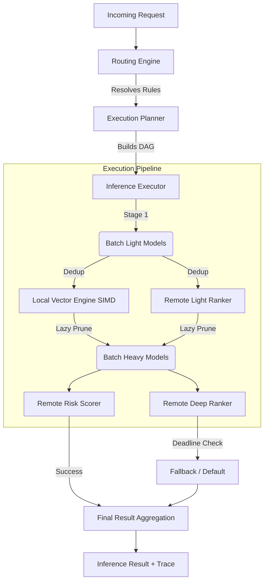

# ML Inference Routing SDK


A production-quality, public-safe ML inference orchestration SDK for latency-sensitive backend services.

In modern ML architectures, evaluating a single user request often requires scoring hundreds or thousands of candidates against multiple machine learning models. A naive implementation—calling remote model serving endpoints in a `for` loop—results in a **latency explosion**, network saturation, and frequent SLA breaches.

This SDK solves this by treating online ML inference as a **strict execution graph (DAG) problem**, applying database-style query optimizations (pruning, batching, deduplication) to machine learning inference.

---

## 🧠 Core Logic & Execution Flow

The SDK operates on a **Research -> Plan -> Execute** lifecycle for every incoming request:

1. **Contextual Routing:** An incoming `RequestContext` (containing candidate entities and request attributes) is evaluated against declarative `RoutingRule`s. The engine determines exactly which models need to be executed for this specific request.
2. **Topological Planning (DAG):** The `ExecutionPlanner` recursively resolves model dependencies. It builds a Directed Acyclic Graph (DAG) and sorts the models into parallel execution stages. (e.g., If Model C depends on Models A and B, A and B are placed in Stage 0 to run in parallel, and C is placed in Stage 1).
3. **Optimized Execution:** The `InferenceExecutor` processes the DAG asynchronously using `CompletableFuture`s. 
   - **Deduplication:** Identical feature vectors within the request are computed only once.
   - **Lazy Pruning:** Candidates are filtered between stages (e.g., only pass the Top 10 results from Stage 0 to Stage 1).
   - **Batching:** Candidates are grouped into optimal chunk sizes to minimize remote network overhead.
4. **Resiliency & Fallbacks:** Strict global request deadlines and per-model timeouts are enforced. Retries are strictly banned on the hot path. If a model times out, the executor seamlessly applies a configured `FallbackStrategy` (e.g., `CONSTANT_SCORE`, `DEFAULT_OUTPUT`) and continues the DAG execution.

---

## 🎯 Enterprise Use Cases & Applications

This SDK is designed for high-throughput systems where milliseconds matter.

### 1. Multi-Stage Search & Recommendation Ranking
* **The Problem:** You have 1,000 document candidates to rank for a search query. Sending all 1,000 to a heavy remote Deep Neural Network (DNN) takes 500ms (unacceptable).
* **The Application:** 
  - **Stage 1 (Local):** Route all 1,000 candidates through a lightweight `light_ranker` running entirely locally in the JVM using our **Java Vector API (SIMD)** integration. Latency: ~5ms.
  - **Pruning:** A lazy predicate automatically drops the bottom 950 candidates.
  - **Stage 2 (Remote):** Batch the remaining 50 candidates and send them to the heavy remote `deep_ranker`. Latency: ~40ms.
  - **Result:** Full deep ranking achieved in < 50ms.

### 2. Fraud Detection & Risk Scoring
* **The Problem:** A checkout transaction must be evaluated by 5 different fraud models (IP risk, device fingerprinting, behavioral analysis) before approval. If one model is slow, the user abandons the checkout.
* **The Application:** The SDK plans the 5 models as parallel, independent nodes in a DAG. A strict 100ms deadline is enforced. If the `behavioral_analysis` model times out, the SDK catches it, emits a trace event, applies a `CONSTANT_SCORE` fallback (e.g., moderate risk), and allows the transaction to proceed without failing the entire checkout.

### 3. Content Personalization Pipelines
* **The Problem:** Generating a personalized feed requires running identical user embeddings against hundreds of different items. 
* **The Application:** The SDK's native **Deduplication** cache recognizes repeated user feature vectors within the request boundary, computing the heavy embedding transformations only once and sharing the result across all item candidate evaluations.

---

## 🏗️ System Architecture



## 📦 Module Overview

- `ml-routing-core`: The framework-agnostic engine. Config parsing, registry, DAG planner, async executor.
- `ml-routing-vector-inference`: Optional local inference engine using `jdk.incubator.vector` for extreme low-latency dense layer execution.
- `ml-routing-examples`: Executable examples demonstrating low latency and DAG evaluation.
- `ml-routing-benchmarks`: JMH benchmarks comparing naive vs optimized execution.

## 🚀 Quick Start & Requirements

Requires **Java 21** and Maven.

```bash
# Build the project
mvn clean install

# Run the Search Ranking Example
mvn -pl ml-routing-examples exec:java -Dexec.mainClass="com.github.placeholder.mlinference.examples.SearchRankingExample"

# Run the Deduplication Example
mvn -pl ml-routing-examples exec:java -Dexec.mainClass="com.github.placeholder.mlinference.examples.DedupExample"

# If running the Vector module in your own app, you must enable the incubator module:
java --add-modules jdk.incubator.vector -jar your-app.jar
```

## 📚 Documentation

- [Architecture Design](docs/architecture.md)
- [Execution Model](docs/execution-model.md)
- [Local Vectorized Inference](docs/local-vectorized-inference.md)
- [Config Reference](docs/config-reference.md)
- [Observability](docs/observability.md)
- [Project Roadmap](docs/roadmap.md)

## ⚖️ Tradeoffs & Design Decisions
- **Why no Spring in core?** To maintain the lowest possible startup time and dependency surface area, enabling embedding in any Java framework (Netty, Vert.x, Spring Boot, Ktor).
- **Why fail-fast / fallback instead of retries?** In p99 latency-sensitive applications (sub 50ms), a network timeout means the deadline is likely already blown. Retrying compounds the failure. Returning a safe fallback guarantees system stability.
