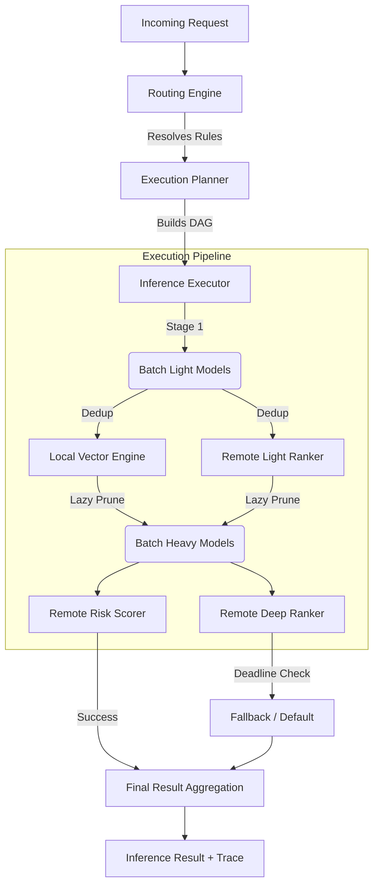

# ML Inference Routing SDK


A production-quality, public-safe ML inference orchestration SDK for latency-sensitive backend services. 

This SDK treats online ML inference as a strict execution graph problem, mitigating the "latency explosion" that occurs when a single backend request fans out into hundreds of naive model network calls.

## Key Concepts

1. **Inference Orchestration:**
   - **DAG Planning:** Automatically resolves model dependencies (e.g., `deep_ranker` depends on `light_ranker`) into execution stages.
   - **Batching & Dedup:** Combines requests to the same model and deduplicates identical feature vectors to slash network overhead.
   - **Lazy Execution:** Prunes unnecessary work early (e.g., only run the heavy model on the top 10 candidates).
   - **Resiliency:** Enforces strict per-model timeouts and global request deadlines. Retries are banned on the hot path in favor of configurable Fallback Strategies.

2. **Inference Optimizations:**
   - Supports seamless routing to remote simulated model serving or local in-memory models.
   - Includes an optional module (`ml-routing-vector-inference`) that leverages the **Java Vector API (SIMD)** for lightning-fast local execution of lightweight dense neural models, avoiding the network hop entirely.

## System Architecture



## Module Overview

- `ml-routing-core`: The framework-agnostic engine. Config parsing, registry, DAG planner, async executor.
- `ml-routing-vector-inference`: Optional local inference engine using `jdk.incubator.vector`.
- `ml-routing-examples`: Executable examples demonstrating low latency and DAG evaluation.
- `ml-routing-benchmarks`: JMH benchmarks comparing naive vs optimized execution.

## Quick Start & Requirements

Requires **Java 21** and Maven.

```bash
# Build the project
mvn clean install

# If running the Vector module, you must enable the incubator module:
java --add-modules jdk.incubator.vector -jar your-app.jar
```

## Documentation

- [Architecture Design](docs/architecture.md)
- [Execution Model](docs/execution-model.md)
- [Local Vectorized Inference](docs/local-vectorized-inference.md)
- [Config Reference](docs/config-reference.md)
- [Observability](docs/observability.md)

## Tradeoffs & Design Decisions
- **Why no Spring in core?** To maintain the lowest possible startup time and dependency surface area, enabling embedding in any Java framework (Netty, Vert.x, Spring Boot, Ktor).
- **Why fail-fast / fallback instead of retries?** In p99 latency-sensitive applications (sub 50ms), a network timeout means the deadline is likely already blown. Retrying compounds the failure. Returning a `CONSTANT_SCORE` fallback guarantees system stability.
